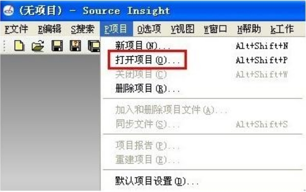
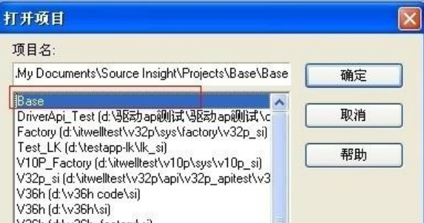
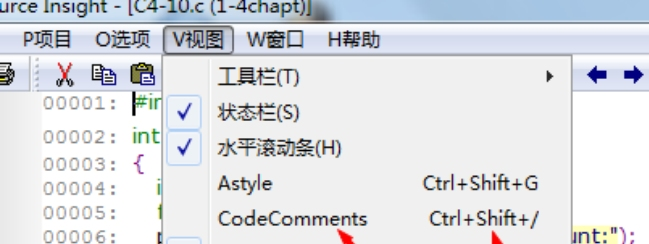

# SourceInsight3.5配置
使用SourceInsight3.5在window看源码的时候很好使用，但是需要自己配置

## 安装
[下载地址](https://www.sourceinsight.com/download/)
~~今天才发现 v4.0出来了,可能我配置的这些功能的在新版本出来了~~

## 配置

#### 汉化
身为中国人，还是看自己的国语舒服很多，那就来汉化吧。先安装英文版，然后覆盖原英文版安装路径下的Insight3.exe

#### SI3_5多行注释
Source Insight  多行注释
* 添加全局宏定义，打开 Source Insight，【项目】---【打开项目】，打开 base 项目

选择 Base，点击确定。

在打开的文件最后添加如下宏定义(详细请参考文件“宏定义.txt”
```c++
macro CodeComments(){//多行注释
 hwnd=GetCurrentWnd()
 selection=GetWndSel(hwnd)
 LnFirst=GetWndSelLnFirst(hwnd)//取首行行号
 LnLast=GetWndSelLnLast(hwnd)//取末行行号
 hbuf=GetCurrentBuf()
 if(GetBufLine(hbuf,0)=="//magic-number:tph85666031"){
 stop
 }
 Ln=Lnfirst 
 buf=GetBufLine(hbuf,Ln)
 len=strlen(buf)
 while(Ln<=Lnlast){
 buf=GetBufLine(hbuf,Ln)//取 Ln 对应的行
 if(buf==""){//跳过空行
 Ln=Ln+1 
 continue
 }
 if(StrMid(buf,0,1)=="/"){//需要取消注释,防止只有单字符的行
 if(StrMid(buf,1,2)=="/"){
 PutBufLine(hbuf,Ln,StrMid(buf,2,Strlen(buf)))
 }
 }
 if(StrMid(buf,0,1)!="/"){//需要添加注释
 PutBufLine(hbuf,Ln,Cat("//",buf))
 }
 Ln=Ln+1
 }
 SetWndSel( hwnd, selection )
}
```

* 添加进菜单
在选项(Options)->菜单分配(Menu  Assignments)中你就可以看到这个宏了,看不到可以重启 si，同步一下试试。名字叫 CodeComments，然后选择菜单合适的菜单下插入即可


* 添加快捷键
然后在"Options"->"Menu  Assignments"窗口点击右下角倒数第二个按钮
"Keys.."，在 Command 输入框输入 CodeComments，然后给这个宏添加热键，点击"Assign New Key..."，输入"Ctrl + Shift + /"，点击 OK 即可。
快捷键可以根据自己的习惯修改，由于"Ctrl + /"已被占用，可以修改或者覆盖。

#### SI3_5自动排版
**查看相应文件夹下的文档**
